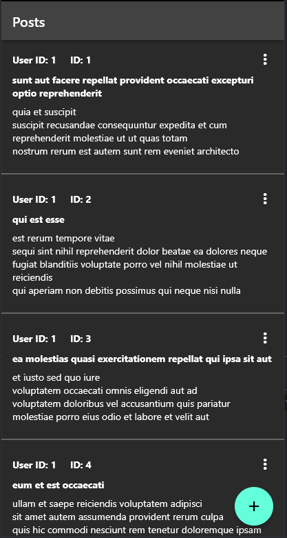
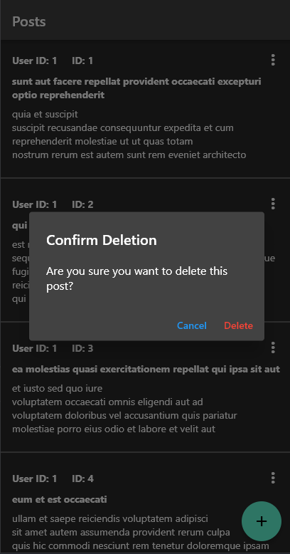
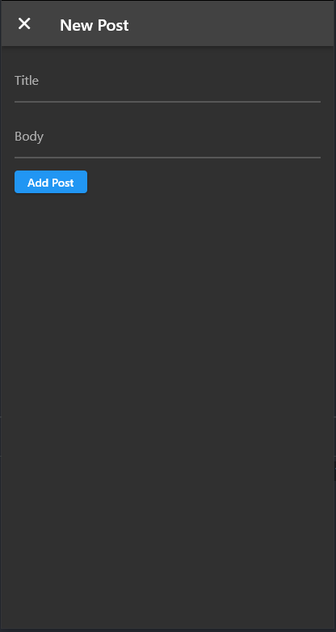

Post Fetch Application Overview
-------------------------------

### Introduction

This application is designed to fetch post data from an API, built using Flutter, and utilizes Flutter Bloc for managing the application's state.

### Data Fetching

The app uses Bloc to fetch post data from an API automatically when the app is loaded or when the user refreshes the post screen, ensuring that the post data remains up-to-date.

### Post Display

Fetched posts are displayed on the main screen of the app. Users can scroll down to view all the posts, and each post contains information such as the user ID, post ID, title, and content.

### Adding Posts

Users can add new posts by clicking the "Add" button at the bottom of the screen. Clicking this button navigates users to a new post creation page where they can enter post details. When the "Add Post" button is pressed, the app adds the new post and displays it on the main screen.

### Post Deletion

The app also allows users to delete posts they no longer need. Users can delete a post by clicking the "..." icon on each post and selecting "Delete". A confirmation dialog then appears to confirm the deletion.

### Responsive Display

The application is designed to work on various devices, adjusting the size and layout of the screen to fit the specific device's screen size. For example, larger screens may display additional information or rearrange lists to ensure optimal display.

----------

### Image

